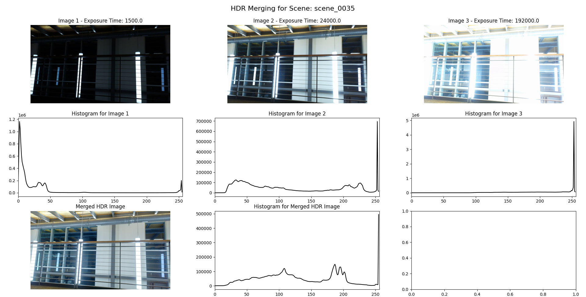

# CSI5170-Project
ML project for HDR camera exposure time prediction

Install required libraries:

`pip install numpy scikit-learn scikit-optimize opencv-python matplotlib`

Demo model may be trained and tested by running train_model.ipynb